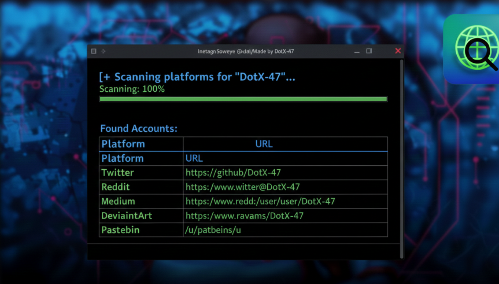
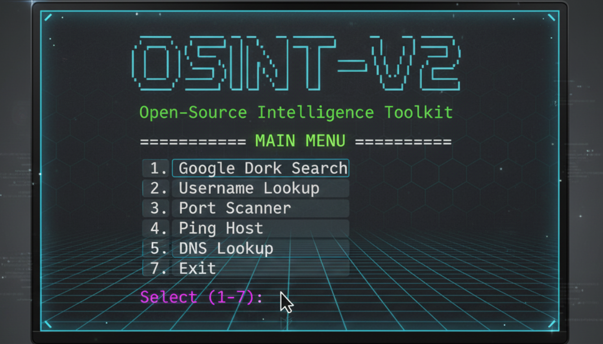

# 🛰️ OSINT_V2 Toolkit



A powerful, terminal‑based **OSINT (Open Source Intelligence) reconnaissance toolkit** written in Python.  
Designed for ethical hackers, cybersecurity researchers, and digital investigators, this toolkit offers a streamlined command‑line interface packed with multiple reconnaissance modules.

## ✨ Features

### 🔍 Search & Intelligence  
- **Google Dork Search** – Automate advanced Google operators to quickly uncover exposed files, misconfigured servers, and publicly indexed sensitive data.  
- **Username Enumeration** – Check the availability of a username across **100+ platforms** including social networks, developer hubs, forums, dark web mirrors, and more.  

### 🌐 Network Tools  
- **Port Scanner** – Lightweight and fast port scanning to identify open services and potential attack surfaces.  
- **Ping Host** – Test network connectivity and latency for any given IP or domain.  
- **DNS Lookup** – Retrieve A, MX, CNAME, TXT and other DNS records to understand domain configuration.  

### 🕸️ Web Recon  
- **URL Analyzer** – Inspect URLs, extract metadata, identify redirects, and flag suspicious patterns.  

### 🖥️ Interactive Experience  
- **Animated ASCII UI** – A smooth and engaging terminal interface designed to enhance usability and provide visual feedback during scans.

## 📦 Installation

```bash
git clone https://github.com/DotX_47/OSINT_V2.git

pip install -r requirements.txt
```

## ▶️ Usage

```bash
python OSINT_V2.py
```



## 🛠️ Requirements  
- Python 3.8+  
- Standard Linux/Mac/Windows terminal  
- Internet connection (for web‑based modules)


## ⚠️ Disclaimer  
For educational and ethical purposes only.

## ⭐ Support  
Star ⭐ the repo if you like the project!
